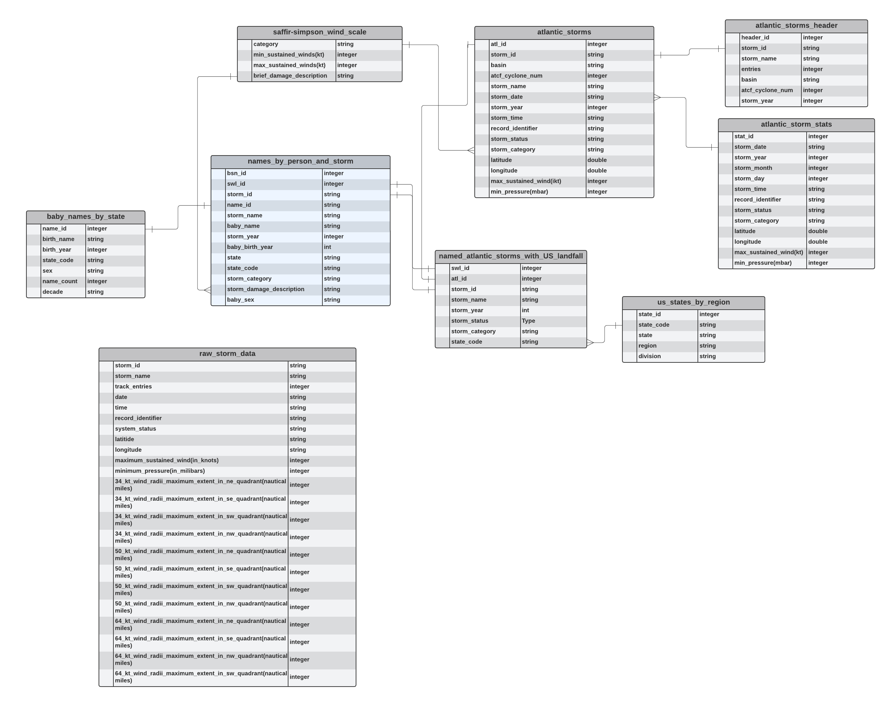

# Exploring People and Storm Names
## Introduction
As a data engineer I need to build an ETL pipeline that will allow analysts to identify any potential patterns in names between people and storms. All the data - a directory of TXT files with names by state data, a CSV of HURDAT2 storm data, and JSON of State data - resides in S3.
## Project Objective
Build an ETL pipeline that pulls publicly available state, baby name, and storm datasets into an S3 bucket, processes it with Pandas Spark, and writes it back to S3 as a set of dimension and fact tables.
## Contents
1. create_resources.py: Python file with functions to run pre-ETL processing
2. delete_resources.py: Python file with functions to run post-ETL clean up
3. mainETL.py: Python file with functions to run ETL processing using PySpark and Pandas
4. dl.cfg: Configuration file which holds AWS, S3, and EC2 credentials
5. requirements.txt: List of Python packages required to complete the ETL
6. Capstone_Project_Final.ipynb: Jupyter notebook with ETL processing in Pandas and Spark
7. Data Lake Schema
8. raw_data/: directory of raw source files fot ETL consumption
9. capstone_data_dictionary.xlsx: Excel file with projects data dictionary
## Schema

## Prerequisites
1. AWS IAM User with `AmazonS3ReadOnlyAccess` and `AdministratorAccess` permission policies
2. Subnet Groups (with default VPC)
## How to Run
1. Add to dl.cfg
* AWS credentials (without quotes)
* Add `subnet_id` 
* Add `bucket_name`
* Add `keyName`
* Add `cluster_name`
2. After setting up dl.cfg, run 
```
python create_resources.py
```
**When prompted,**
* type `y` to uninstall awscliv1
* type `yes` to connect to the cluster
**Once connected to the EMR cluster,**
* type `logout`
3. Once in the Hadoop terminal AFTER the necessary files have been copied,
* Install requirements using `pip install --user -r requirements.txt`
* Run `spark-submit mainETL.py`
4. Upon completion of ETL processing with Spark
* Create a notebook with your EMR cluster in the UI and use Spark to perform analysis of the data
**or**
* run
```
python delete_resources.py
```
to clean up all AWS resources.
